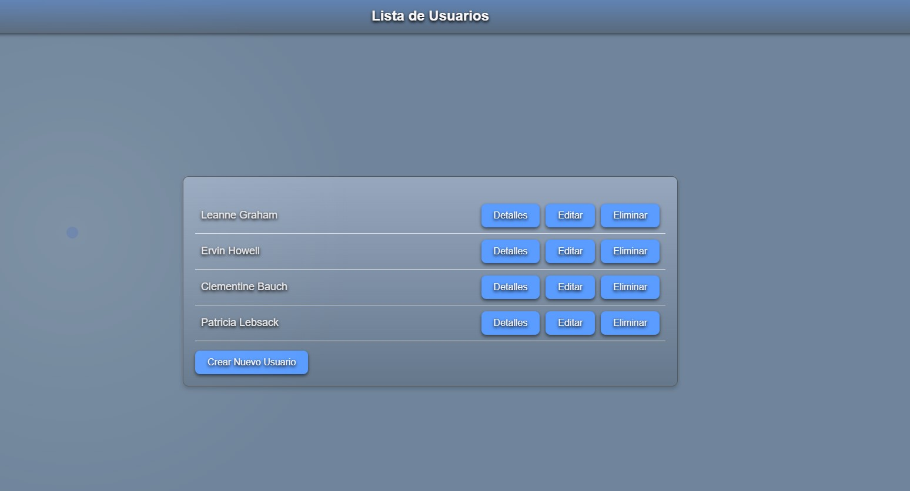
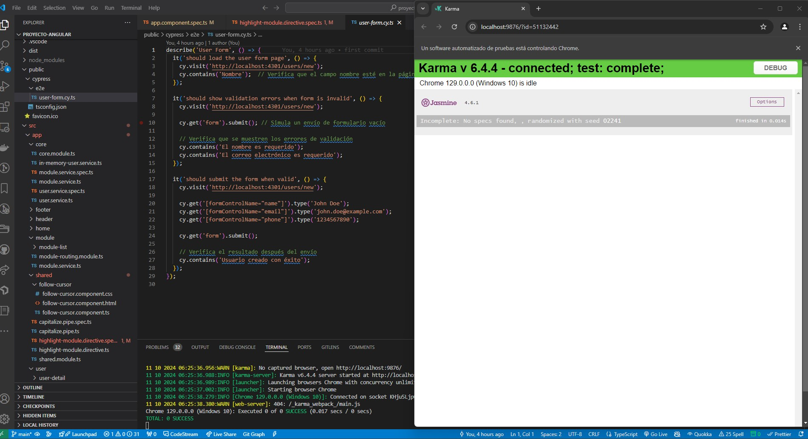

# 👥 Proyecto de Gestión de Usuarios en Angular

## Capturas de pantalla

- **Pantalla principal de la aplicación**  

- **Pantalla principal de la aplicación**  

# Proyecto de Gestión de Usuarios en Angular

Este proyecto es una aplicación web desarrollada con **Angular** que te permite gestionar usuarios: crearlos, editarlos, eliminarlos y ver detalles sobre ellos, además de ver los módulos asignados a cada usuario. Incluye pruebas para asegurar que todo funcione correctamente usando **Jasmine/Karma** para las pruebas de funcionalidad, y **Cypress** para simular lo que haría un usuario real en la aplicación.

## Capturas de pantalla o GIFs**:  
- Capturas de pantalla, GIFs del funcionamiento de la aplicación y de las pruebas E2E, Jasmine/Karma y unitarias, guardadas en la carpeta `assets/screenshots`.

## Características principales

- Crear, ver, editar y eliminar usuarios.
- Integración con la API de **JSONPlaceholder** para obtener datos de usuarios y módulos.
- Diseño moderno y adaptado para todo tipo de pantallas (responsivo).
- Pruebas automáticas para asegurar que todo funcione bien.

# Cómo instalar y ejecutar el proyecto

## Requisitos
- Node.js (versión 14 o superior)
- npm (la herramienta que viene con Node.js)
- Angular CLI (opcional pero recomendado)
- Puedes instalarlo con el siguiente comando:
    `npm install -g @angular/cli`

# Instalación del proyecto

## Descarga el proyecto (Clonar el repositorio):
`git clone https://github.com/usuario/proyecto-angular-limpio.git`
## Entra en la carpeta del proyecto:
`cd proyecto-angular-limpio`
## Instala las dependencias (paquetes necesarios):
`npm install`

# Cómo iniciar el proyecto

## Levanta el servidor de desarrollo:
`ng serve --port 4301`
  **Abre el navegador en** `http://localhost:4301` **para ver la aplicación funcionando.**

## Cómo hacer pruebas en el proyecto

## Pruebas de funcionalidad con Jasmine/Karma
Este proyecto usa **Jasmine** para hacer pruebas unitarias (para checar que cada parte de la aplicación funcione bien) y **Karma** como una herramienta para correr estas pruebas.

###	Para correr las pruebas:
`ng test`

- **Ejemplo de pruebas  Jasmine/Karma**   

## Pruebas E2E con Cypress

### Asegúrate de haber instalado Cypress con:
`npm install cypress --save-dev`

- **Ejemplo de pruebas E2E con Cypress**  

## Para abrir Cypress y ejecutar las pruebas:
`npx cypress open`

## Si prefieres correr las pruebas sin abrir el navegador, puedes hacerlo con:
`npx cypress run`

## Descripción de carpetas y archivos

- **app/core/**: Contiene los servicios principales de la aplicación, como `InMemoryUserService` y `ModuleService`.
- **app/footer/**: Incluye el componente `FooterComponent`, que es parte del diseño global de la aplicación.
- **app/user/**: Aquí se encuentran los componentes relacionados con la funcionalidad de usuarios, como `UserListComponent`, `UserFormComponent`, y `UserDetailComponent`.
- **app/shared/**: Incluye componentes reutilizables en toda la aplicación, como `FollowCursorComponent`.
- **app.component.ts**: El componente raíz de la aplicación, donde se manejan las vistas principales.
- **app.routes.ts**: Define la configuración de rutas para la navegación en la aplicación.
- **assets/**: Contiene recursos estáticos, como imágenes y íconos.
- **environments/**: Archivos de configuración para los entornos de desarrollo y producción.
- **styles.css**: Archivo de estilos globales para toda la aplicación.

 # Autor
Este proyecto fue desarrollado por **Yeison Eduardo Alvarez Garcia**

